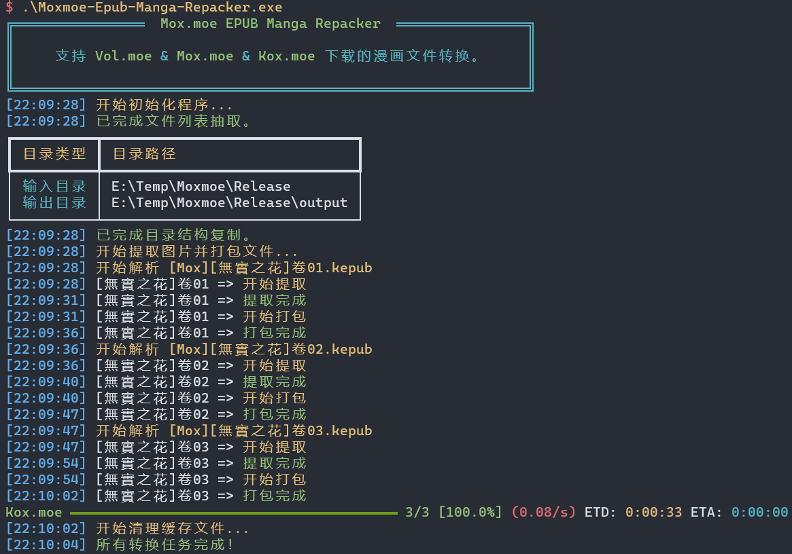

# Mox.moe Epub Manga Repacker

 

English | [中文](./README_ZH.md)

## Declaration

**Attention!** This project does not provide manga document download services. You still need to download manga through the free or paid services provided by the website.

**Attention!** This project is only applicable to EPUB documents downloaded from the website [Kox.moe](https://kox.moe) or its mirror sites. The developer is not responsible for documents obtained from other sources if the conversion fails.

**Attention!** This project follows the MIT licence and does not generate any advertising revenue. Anyone can use it for free, but please refrain from promoting this project on manga websites to avoid unnecessary legal disputes. The developer is happy to see this project serve everyone.

If you encounter any issue during usage, please submit it, and I will do my best to resolve it within my knowledge.

## Principle

The design concept of this project is to first unpack the EPUB document as a ZIP archive, rename each page's image files according to the numerical order in the HTML names, and then package the image files into a CBZ document.

This project can convert single or multiple manga files. It can also maintain the original directory structure when converting manga saved in complex directory structures.

## Usage

Clone this project using the following command:

```shell
git clone https://github.com/Haoyi-Han/Moxmoe-Epub-Manga-Repacker.git
cd Moxmoe-Epub-Manga-Repacker
```

The project configuration file format is as follows:

```toml
[DEFAULT]
InputDir =  "path/to/your/input/folder"
OutputDir = "path/to/your/output/folder"
CacheDir =  "path/to/your/cache/folder"
Exclude = [folders & files to exclude in the paths you provide]
UseExtern7z = false
Extern7zExec "path/to/your/7z/executable"
```

Copy the manga document (or entire folder) to the folder pointed to by `InputDir`. **Attention!** Please avoid using special Unicode characters other than common symbols, letters, numbers, and CJK characters in the naming of subfolders and files.

Run the `main.py` script:

```shell
python main.py
```

The screenshot of the program during execution is as follows (not the latest version, for rough reference).



Wait for the program to finish running. Afterward, you can enter the folder pointed to by `OutputDir` to check the conversion results.

## Build

It is recommended to use `poetry` or `pixi` to set up the Python working environment.

It is recommended to use `Nuitka` to build the executable application.

- Windows platform: Run different commands based on the package management tool.
  - Poetry: `make.ps1 build -e poetry` (the `-e poetry` can be omitted)
  - Pixi: `make.ps1 build -e pixi` or `pixi run build`
- Unix platform: Run different commands based on the package management tool.
  - Poetry: `make build BUILD_SYS=poetry` (the `BUILD_SYS=poetry` can be omitted)
  - Pixi: `make build BUILD_SYS=pixi` or `pixi run build`

The built single-file program can then be found in the `build` folder.

You can use `make.ps1 help` or `make help` to view the supported command help.

To ensure the proper operation of this program, you need to create a `config.toml` configuration file in the directory where the executable file is located and complete the specified directory paths in the configuration file.

For the Windows platform, as an optional step, if you wish the program to display progress synchronously on the taskbar during runtime, you will need to copy the `tl.tlb` file from the repository to the directory where the executable file is located. This file is a link library file provided by Microsoft to control the taskbar behavior, and you can also download it manually.

## Stargazers over time

[](https://starchart.cc/Haoyi-Han/Moxmoe-Epub-Manga-Repacker)

## Acknowledgments (Project Inspiration)

[GeeKaven/vol-moe-comic-scirpt](https://github.com/GeeKaven/vol-moe-comic-scirpt): Main code logic reference

[yeeac/epub-comic-repacker](https://github.com/yeeac/epub-comic-repacker): Auxiliary code logic reference

[Zeal-L/BiliBili-Manga-Downloader](https://github.com/Zeal-L/BiliBili-Manga-Downloader): Reference for writing `ComicInfo.xml`